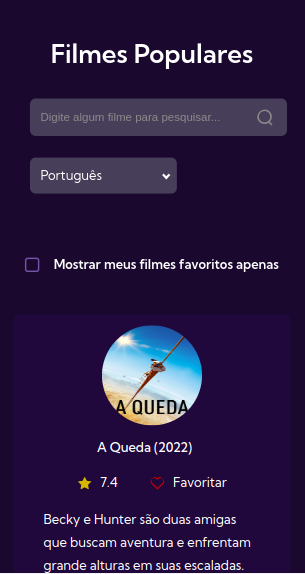
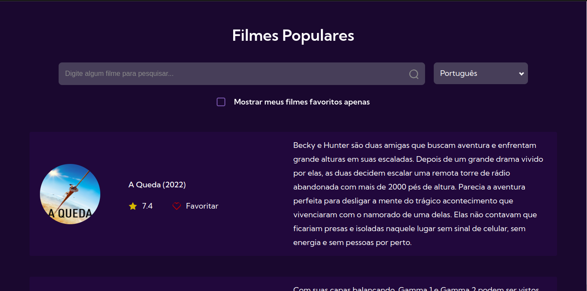

  
   

# JavaScript e DOM | API

### Tópicos

- [Descrição do projeto](#descrição-do-projeto)
  - [Funcionalidades](#funcionalidades)
  - [Processo de desenvolvimento](#processo-de-desenvolvimento)
  - [Screenshot](#screenshot)
  - [Mobile](#mobile)
  - [Desktop](#desktop)
- [Status do projeto](#status-do-projeto)
- [Linguagens utilizadas](#linguagens-utilizadas) 
- [Acesso ao projeto](#acesso-ao-projeto)
- [Autora](#autora)

## Descrição do projeto

Resolução do desafio [7 days of code](https://7daysofcode.io/) sobre JavaScript e DOM que consiste em consumir a API de filmes do [The Movie DataBase](https://www.themoviedb.org/) e desenvolver uma página de filmes populares com JavaScript puro.

### Funcionalidades
Além de listar os 100 filmes mais populares do momento, a aplicação permite:
* Navegar pelas páginas de resultado,
* Pesquisar filmes pelo título,
* Favoritar/desfavoritar um filme (e salvar essa informação), 
* Mostrar apenas os filmes favoritados,
* Selecionar linguagem português ou inglês.

### Processo de Desenvolvimento
A partir desse desafio treinei: 
* Consumir uma API;
* Utilizar o localStorage;
* Manipulação do DOM;
* Layout responsivo.

## Screenshot 

### Mobile

  

### Desktop

## Status do Projeto
Finalizado

## Linguagens Utilizadas
* HTML;
* SASS;
* JS

## Acesso ao projeto
Você pode acessar o [código fonte do projeto](https://github.com/nalutm/movie-catalog). 
Também pode acessar a [página para conferir o resultado final](https://movie-catalog-psi.vercel.app/#top).

## Autora
[Nayara Luiza Tavares Moraes](https://github.com/nalutm)
